# 📊 Diagrammes Logiques des Modules

## 🏗️ Architecture Générale

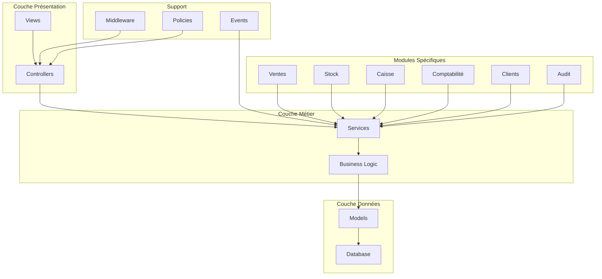

## 🔄 Flux Vente Complet

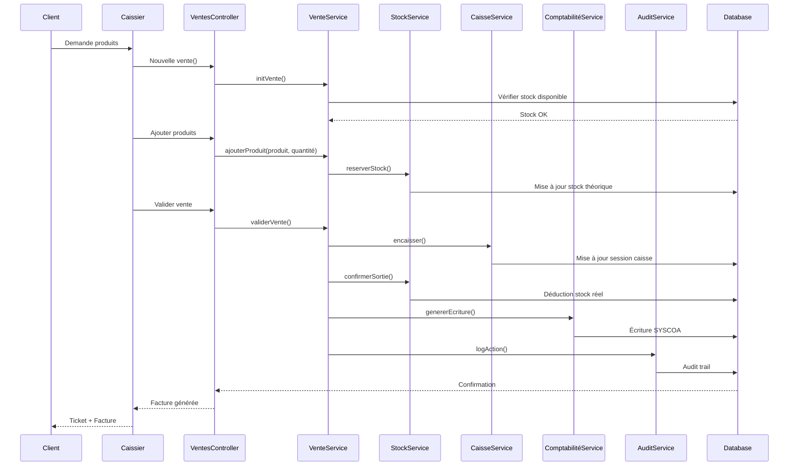

## 📦 Module Stock

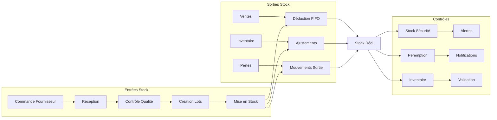

## 💰 Module Caisse

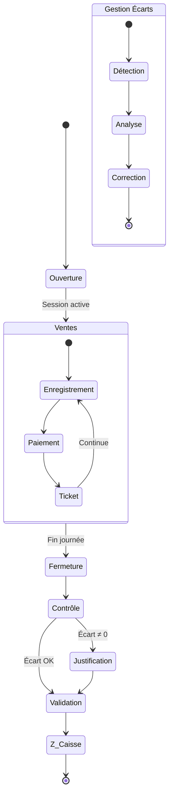

## 🏦 Module Comptabilité SYSCOA

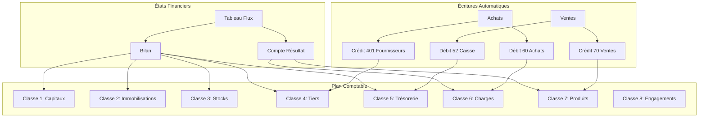

## 🔐 Sécurité et Permissions

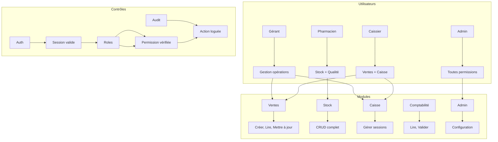

## 📊 Flux Données Complet

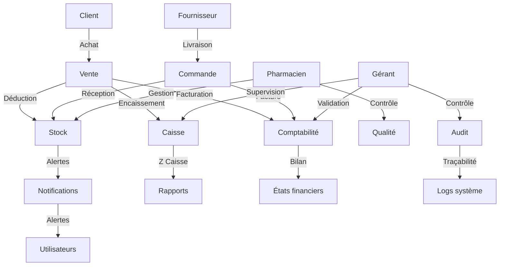

## 🔄 Cycle de Vie Produit

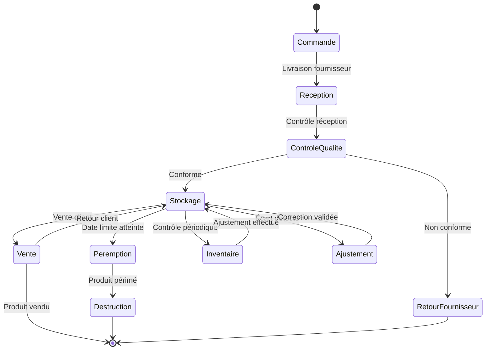

## 🎯 Matrice des Dépendances

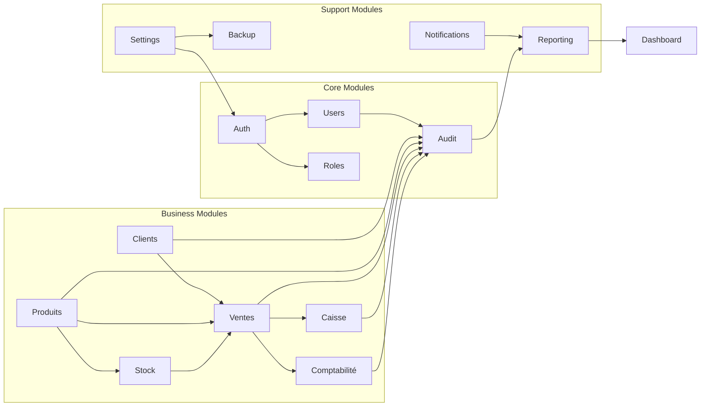

## 📈 Architecture Événementielle

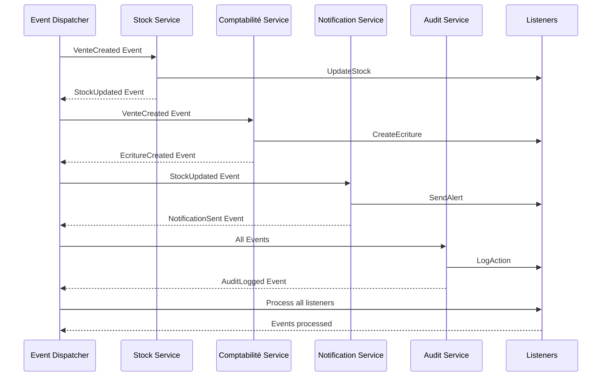

## 🔍 Architecture de Persistance

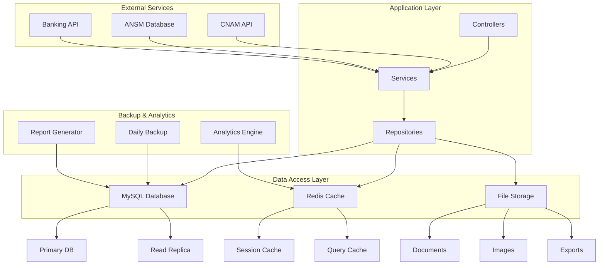

Ces diagrammes illustrent l'architecture complète du système avec :
- **Séparation des responsabilités** claire entre couches
- **Flux de données** optimisés et sécurisés
- **Gestion des événements** pour réactivité
- **Persistance robuste** avec cache et backup
- **Intégrations externes** pour conformité réglementaire
